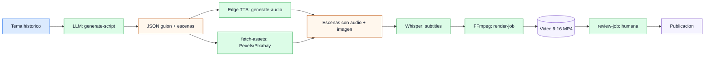

# shorts-creator

<div align="center">


Plataforma automatizada de generacion de videos cortos verticales (Shorts / TikTok / Reels) de divulgacion historica, con trazabilidad total, calidad controlada y costes predecibles.


<a href="docs/project/vision.md"></a>
<a href="docs/project/architecture.md"></a>
<a href="docs/project/roadmap.md"></a>
<a href="docs/project/integrations.md"></a>
<a href="openspec/project.md"></a>

</div>

## Vision

Generar videos de divulgacion historica de principio a fin sin intervencion manual: un tema de entrada produce un guion con IA, locucion natural, imagenes de epoca, subtitulos sincronizados y un render 9:16 listo para publicar. Todo versionado, trazable y con calidad verificable.

## De un vistazo

| Area | Stack |
|---|---|
| Orquestacion | n8n sobre Docker Compose |
| Locucion | Edge TTS (voz natural, gratuita, sin API key) |
| Guion | LLM configurable (OpenAI, Claude, Gemini) |
| Imagenes | Pexels + Pixabay + fallback local |
| Render | FFmpeg (9:16, subtitulos ASS, transiciones) |
| Gobierno tecnico | spec-first + OpenSpec + bitacoras |

## Showcase

```
Tema historico ──► LLM genera guion estructurado
       │
       ├──► Edge TTS genera locucion natural
       │
       ├──► API imagenes consigue assets visuales
       │
       └──► FFmpeg render video 9:16 con subtitulos
                    │
                    └──► Revision humana ──► Publicacion
```

Ruta narrativa del pipeline:

- **Entrada**: un tema historico (ej: "La caida de Constantinopla").
- **Guion**: LLM genera JSON estructurado con escenas, narracion y plano visual.
- **Audio**: Edge TTS produce locucion por escena, con tiempos exactos.
- **Subtitulos**: Whisper genera timestamps; se sincronizan con ASS.
- **Visual**: Pexels/Pixabay + collage local si no hay resultados.
- **Render**: FFmpeg compone video 9:16 con transiciones y fundidos.
- **Revision**: `review_job.py` permite validar antes de publicar.

## Mapa de alto nivel



## Quickstart

```bash
make doctor          # valida prerequisitos
make stack-up        # levanta n8n + postgres + opencode
```

Acceso local a n8n: `http://localhost:5679`

```bash
make doctor         # valida Docker, FFmpeg, .env
make docker-up      # levanta n8n + postgres
make docker-logs    # logs de n8n
make test           # valida estructura del proyecto
make stack-down     # apaga el stack
```

Para generar un video manualmente:

```bash
pip install -r requirements.txt
python bin/generate_script.py "La caida de Constantinopla"
python bin/generate_audio.py
python bin/fetch_images.py
python bin/render_job.py
```

## Navegacion rapida

| Quiero... | Ir a |
|---|---|
| Entender la vision del proyecto | `docs/project/vision.md` |
| Ver la arquitectura tecnica | `docs/project/architecture.md` |
| Conocer el roadmap por fases | `docs/project/roadmap.md` |
| Revisar integraciones validadas | `docs/project/integrations.md` |
| Ver modelo de costes | `docs/project/cost-model.md` |
| Leer decisiones de arquitectura (ADRs) | `docs/decisions/` |
| Ejecutar runbook local | `docs/runbooks/local-development.md` |
| Ver estado actual del proyecto | `docs/project/current-state.md` |
| Explorar cambios activos en OpenSpec | `openspec/changes/` |
| Ver bitacoras de sesiones | `docs/sessions/` |

<details>
<summary><strong>Estructura del repositorio</strong></summary>

```
shorts-creator/
  bin/                  # Scripts Python del pipeline
  data/                 # Assets, audios, renders, metadata
  docs/                 # Documentacion: proyecto, sesiones, runbooks
    decisions/          # ADRs (Architecture Decision Records)
    project/            # Vision, arquitectura, roadmap, integraciones
    runbooks/           # Guias operativas
    sessions/           # Bitacoras de sesiones
  openspec/             # OpenSpec: proyecto y cambios activos/cerrados
    changes/            # Cambios especificos con design, specs, tasks
  tests/                # Tests de validacion del pipeline
  workflows/            # Exportables de workflows n8n versionados
  .opencode/            # Agentes y skills para asistencia IA
  AGENTS.md             # Reglas de operacion para agentes IA
  Makefile              # Comandos de operacion del proyecto
  docker-compose.yml    # Stack: n8n + postgres + render-worker
```

</details>

<details>
<summary><strong>Principios de arquitectura</strong></summary>

- **n8n como orquestador**: los workflows encadenan llamadas a LLM, scripts y APIs.
- **Pipeline local**: sin backend permanente; cada script es autocontenido y ejecutable.
- **Trazabilidad total**: cada video tiene metadata JSON, bitacora y cambio OpenSpec.
- **Coste controlado**: Edge TTS gratuito, imagenes de APIs gratuitas, LLM bajo demanda.
- **Portabilidad**: Docker + FFmpeg como unica dependencia obligatoria.
- **Spec-first**: cualquier cambio significativo pasa por diseno documentado antes de implementar.

</details>

<details>
<summary><strong>Convencion de operacion</strong></summary>

- Arrancar/parar stack via `make` (ver seccion Quickstart).
- Los workflows n8n se importan desde `workflow-*.json` en la raiz.
- Trabajar sobre cambios OpenSpec antes de modificar el pipeline.
- Registrar bitacora en `docs/sessions/` tras cada bloque de trabajo.
- Las integraciones nuevas deben validarse y documentarse en `docs/project/integrations.md`.

</details>

## Proximo paso recomendado

1. Leer `docs/project/vision.md` para contexto completo.
2. Ejecutar `make doctor` para verificar entorno local.
3. Explorar `openspec/changes/` para entender cambios activos.
4. Revisar `docs/sessions/` para trazabilidad de trabajo previo.
